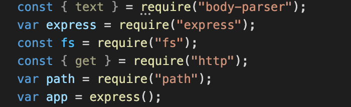

# Note Taker
<hr>

[](https://opensource.org/licenses/MIT)

## Description

Website that stores user notes

### Table of Contents

*[Usage](#usage)

*[Process](#process)

*[License](#license)

*[Contributing](#contributing)

*[Questions](#questions)


## Usage
 
To use the application, simply click on the deployed link. 
[https://briannotetaker.herokuapp.com/](https://briannotetaker.herokuapp.com/)

## Process

### Create A Server

To create a server, first require the following.


Then create either a local port or server based port and set up server using the following code.

```bash
var PORT = process.env.PORT || \'local server id\'
app.use(express.urlencoded({exteneded: true}));
app.use(express.json());
...
code
...
app.listen(PORT,function());
```


### Creating Paths for the HTML's

By using the below line of code, the server will be linked to the htmls desired.

```bash
app.get(\"/htmlname\",function(req,res)){
    res.sendFile(path.join(__dirname,\"/filepath\"));
}
```

### Server Performers

By using the the formatting below different data can be accessed from the html or perhaps a database depending on where the data is being pulled from

```bash
app.get(\"/filepath\",function(req,res)){
    use req to take from input
    use res to to output
}
```

## License

This Project is licensed under the MIT License

## Built With:
* [HTML](https://developer.mozilla.org/en-US/docs/Web/HTML)
* [JS](https://developer.mozilla.org/en-US/docs/Web/JS)
* [Node](https://developer.mozilla.org/en-US/docs/Web/API/Node)


## Author(s):
**Brian Lee**
* [GitHub](https://github.com/brianjunhyuplee)
* [LinkedIn](https://www.linkedin.com/in/brian-lee-559208187/)


## Questions

If you have any questions about the repo, open an issue or contact me directly at [brianjunhyuplee@gmail.com](brianjunhyup@gmail.com). You can find more of my work at [brianjunhyuplee](https://github.com/brianjunhyuplee). 
    